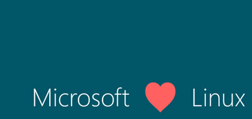

# Welcome to Structured Data--a microcourse on data preparation with python

**In this course you will learn:**

* Python (basic)
* Pandas (basic)
* Input/Output IO in python (basic)
	* E.g., read/write text or csv files
* Loop in python (basic)
* Jupyter notebook (basic)

**OS setup**

* If you are rocking linux/Mac OS you are all set 
* Windows users please install the [Windows Subsystem for Linux](https://docs.microsoft.com/en-us/windows/wsl/install-win10)
 

**Software setup**
* Download and install a package manager: [Anaconda](https://www.anaconda.com/download/)

That's it! fire up your terminal and let's hit the [**hands on
session**](https://gitpitch.com/fibonaccirabbits/structured_data).\
Once you're done, we'd love to hear your [**feedback**](https://goo.gl/forms/cYTLx15fmxId2mG73).

Have fun coding!\
**Your SRC team**

